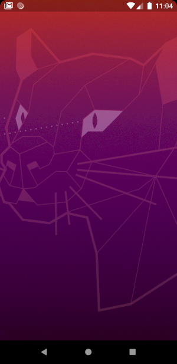
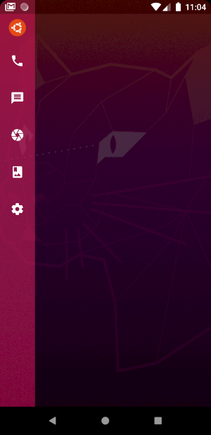
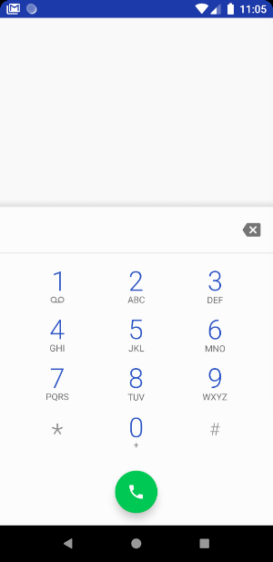
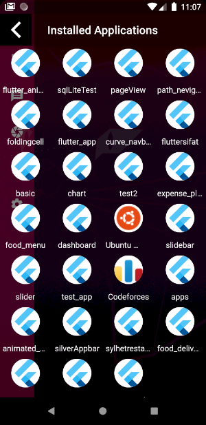
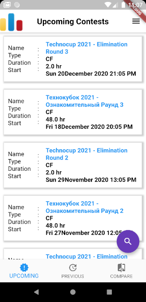

# Ubuntu Launcher 

It's a custom lightweight android launcher.

Here are some screenshots : 

- Home Screen :

  

- Options :
  - Slide right from left to show the options :

  

- Clicking on Dial option takes you to the system dialpad :

  
  
- Clicking on Ubuntu icon (from options) takes you to the Apps installed in your Phone :

  
  
- Click and Open your desired application 

  

I will add some features asap :3 
