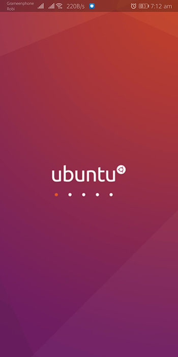
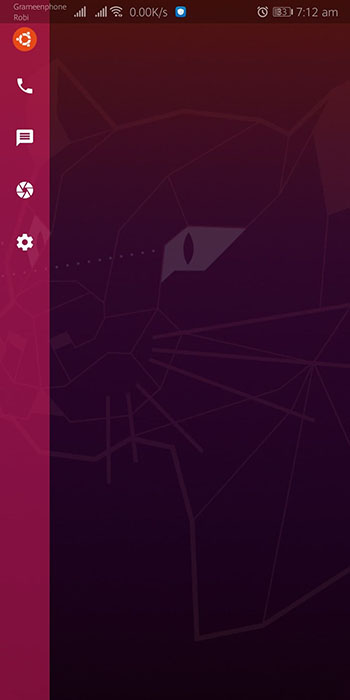
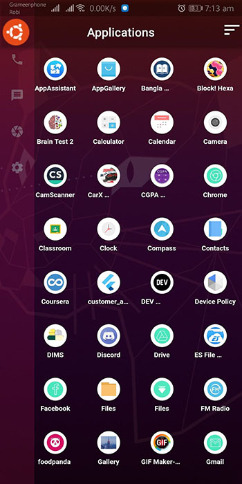
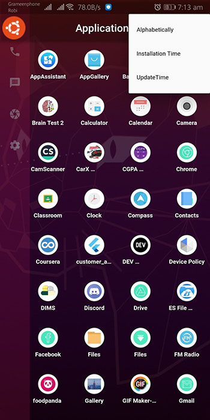

<h1 align="center">
Ubuntu Launcher
</h1>

## Introduction

**Ubuntu launcher** is an custom android launcher build with Flutter with a Ubuntu-Gnome look.
Though flutter is a cross platform UI framework, the launcher has android version only for now.Our launcher is only available on github. Any update and release version will be available here.

  

 

## About

This application is for those who want a simple, clean and fast launcher to use. Most of the launchers in the play store or any market place are full with nasted ui and the most annoying thing is their ads. As it is in an initial stage, I'm trying to add some extra features but not much fancey.
At first, it was made for myself having simple look and customization. Then i decided to make it public.As it is a open source project anyone can use it and the code base is transparent so they can edit and customize it under the license.

## Features

- Use as default launcher
- Simple & Fast UI
- Clean homeScreen
- Slide Bar
- Shortcut Apps on SideBar
- Sort apps according to alphabetically, installation and update time
- Animated navigation
- View Apps' settings
- Ad free

#### Latest Features

- In App drawer, **Press Long** on app to open App Setting

## Requirements

- MinSdkVersion 16 (Android 4.1.x)
- **TargetSdkVersion 28 (Android 9)**
- Hopefully will work fine above android 4.1.x

## Install

- Latest : [Ubuntu Launcher 2.1.0](https://github.com/jspw/Ubuntu-Launcher/releases/tag/2.1.0)
- Old Versions : [Releases](https://github.com/jspw/Ubuntu-Launcher/releases)

Download the apk file and install in your android device.

**Note :** Make sure, 'installation from unknown source' is turned on.

## Screenshots

- **Loading Screen** (When app runs for the first time)

  

- **Home Screen** (Empty for simplicity)

  

- **Side Bar** (Shortcut Menu Options) -> Swap from Left to Righ to open

  

- **App Drawer** (Installed accesible apps)

  

- **Sort Option** (Sort by Apps Name, Installation and Update time)

  

### Demo

## Permissions

On Android version ubuntu launcher requires the following permissions:

- Run at start.
- Read access to installed apps in device.

The "Run at start" permission is required to run the app when device turn on so that the launcher can be used as default.

## Contributing

Ubuntu launcher is a free and open source project. Any contributions are welcome. Here are a few ways you can help:

- [Report bugs and make suggestions.](https://github.com/jspw/ubuntu-launcher/issues)
- Write some code. Please follow the code style used in the project to make a review process faster.

## License

This launcher was originally created by <a href='http://dev-shifat.me/shifat.com/'>Mehedi Hasan Shifat</a> and released under GNU GPLv3 (see [LICENSE](LICENSE)).
Some of the used libraries are released under different licenses.
